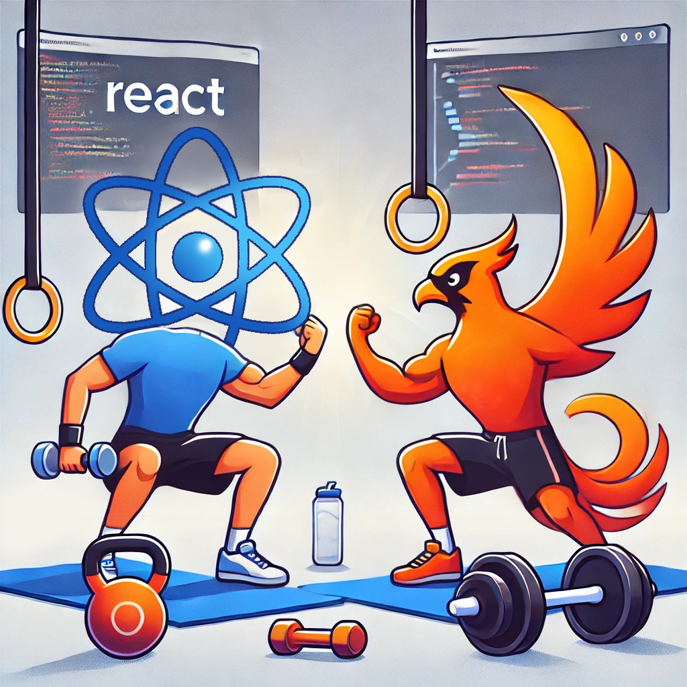
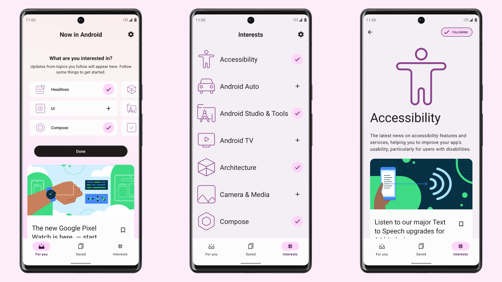

<h1 align="center">Kata-ing In React</h1>
<br />
<div align="center">
  
</div>
<br />
<div align="center">
  <strong>
    Kata-ing React and Phoenix with JSON and APIs.
  </strong>
</div>
<br />
<br />

한국어 | [English](./README-en.md)

## Introduction

Kataing In React는 React와 그리고 React-Query를 이용하여 Frontend, 그리고 Phoenix와 Ecto를 이용하여 JSON API를 제공하는 Backend로 Web app을 빌드하였어요. [nowinandroid](https://github.com/android/nowinandroid)에서 제공하는 경험을 Web App으로 구현해보는 것이 목적이에요. 

추가로 우선 React와 Phoenix로 구현한 다음 LiveView로 구현해보려고 해요.

앱은 현재 개발 중이에요. 배포는 하지 않아요.

## Design

client and a [open API](https://github.com/OAI/OpenAPI-Specification) server with a relational database.

### Server

### Database

### Client

클라이언트는 React와 사용하여 빌드된 Web Application이에요. 서버와는 JSON API를 통해 통신하고, React-Query를 사용하여 상태를 관리하고 있어요. 
[nowinandroid](https://github.com/android/nowinandroid)을 참고하여 구현하고 있어서 UI는 모바일에 최적화되어 있어요.

## Screenshots



<div align="center">
  <strong>
    이 스크린샷은 Now in Android 애플리케이션에서 확인할 수 있어요.
  </strong>
</div>
<br />

Kata-ing in React는 위의 스크린에 최대한 가깝게 구현해보려고 해요.

## Getting Started 🚀

이 프로젝트를 실행하기 전에 Elixir, Node.js, PostgreSQL이 설치되어 있어야 해요.
그런 다음, 다음 명령어를 실행하여 프로젝트를 시작할 수 있어요.

```sh
# fetch dependencies and setup the database
$ mix setup

# start the application
$ mix phx.server

# run tests
$ mix test
```

### Getting Started with Docker 🐳

Docker와 Docker Compose가 설치되어 있다면, 이를 사용해서도 프로젝트를 시작할 수 있어요.

```sh
docker compose -f docker-compose.dev.yml up
```

그러면 client(port: 3000)와 server(port: 4000) 그리고 database가 실행될 거에요. Docker가 관련 서비스를 포트에 바인딩하니 여러분의 machine에서 위의 포트가 사용되고 있지 않은지 확인해주세요. 처음 실행할 때는 Docker 이미지를 빌드하고 모든 dependencies를 설치하므로 시간이 좀 걸릴 수 있어요. 이후 실행은 상대적으로 빠를 거에요.

모든게 컨테이너에 올라가고 실행이 되면 여러분은 앱에 [`localhost:3000`](http://localhost:3000)으로 접속할 수 있어요.

또한, [`localhost:4000`](http://localhost:4000)으로 접속하면 Phoenix LiveView로 구현된 앱에 접속할 수 있어요.

## Learn more
  * Official website(react): https://reactjs.org/
  * Official website(phoenix): https://www.phoenixframework.org/
